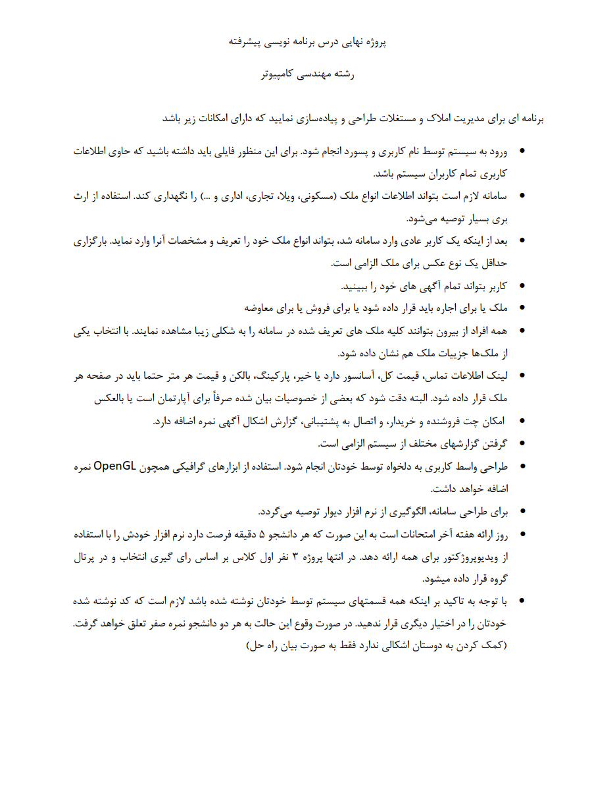

# **🏠 Qt Real Estate Management Project | پروژه سیستم مدیریت املاک با Qt**

**Two university projects where a real estate management system is implemented using Qt.**

**دو پروژه دانشگاهی که در آن یک سیستم مدیریت املاک و مستغلات با استفاده از Qt پیاده‌سازی می‌شود.**

# 💬 **نکات پروژه**

* عکس‌های برنامه در دایرکتوری ScreenShots قرار دارند.
* برای اجرای برنامه، به Qt 5.14.0 یا بالاتر نیاز دارید.
* برای اجرای برنامه، فایل Project.pro یا Project1.pro را باز کنید.
* هر پروژه در دایرکتوری مربوط به خود وجود دارد. کارکرد هر دو برنامه شبیه هم بوده ولی با روش‌های مختلف و ظاهرهای متفاوت پیاده‌سازی شده‌اند.
* برای طراحی این پروژه، از اپلیکیشن دیوار الگوبرداری شده‌است.
* برای اجرا، لطفا فایل با پسوند .pro.user را حذف کرده و دوباره برنامه‌ی Qt Creator را تنظیم نمایید.
* برای دسترسی به همه‌ی پروژه‌های دانشگاهی من، به این لینک مراجعه کنید:

👈🏻 **[پروژه‌های دانشگاهی من](https://github.com/bestmahdi2/Uni__Bachelors_SKU_Path)**

# 📝 **توضیحات پروژه**

# 🖼 **عکس‌های پروژه**

  
  
  
  
  

  
  
  
  
  
  
  
  
  
  
  
  
  
  
  
  
  
  
  

  

